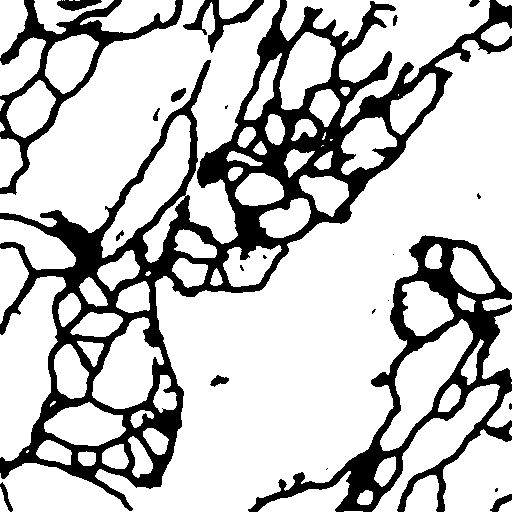
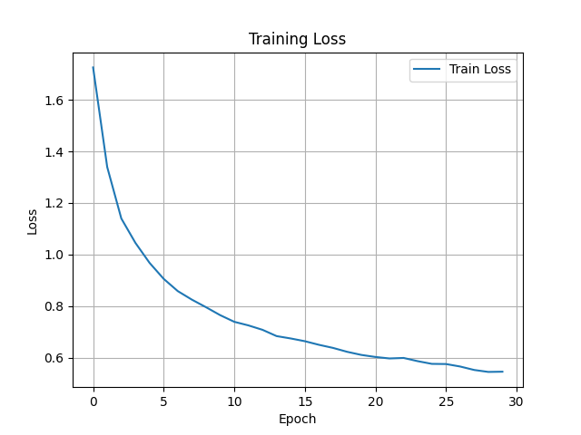

# Unet 神经网络图像分割项目

本项目实现了 **Unet 神经网络**，用于图像分割任务。以下是项目的详细介绍、论文引用、运行效果和环境依赖等信息。

## 论文引用

本项目实现基于 [U-Net: Convolutional Networks for Biomedical Image Segmentation](https://arxiv.org/pdf/1505.04597) 论文。请参考该论文以获得更多关于网络结构和方法的详细信息。

## 参考的数据集
参考数据来自于 ISBI 挑战的数据集。

## 程序运行效果图

程序运行的效果图如下：

- **输入图像：**
  
  
- **分割结果：**
  

## 程序训练的 Loss 图

程序在训练过程中会输出损失（loss）曲线，以下是30个epoch、batchsize为10、lr为0.001的训练过程中的损失变化图：



## 项目环境

本项目的运行环境如下：

- **Python 版本**: 3.10
- **PyTorch 版本**: 2.0.0+cuda11.8

## 依赖库安装

请使用以下命令安装项目所需的所有依赖库：

```bash
pip install -r requirements.txt
```

## 程序运行

请在工程目录下使用以下命令，进行程序运行：
```bash
python train.py
```

## 注意
- **权重放在./model_weight文件夹下，注意程序中的权重读取存放路径。**
